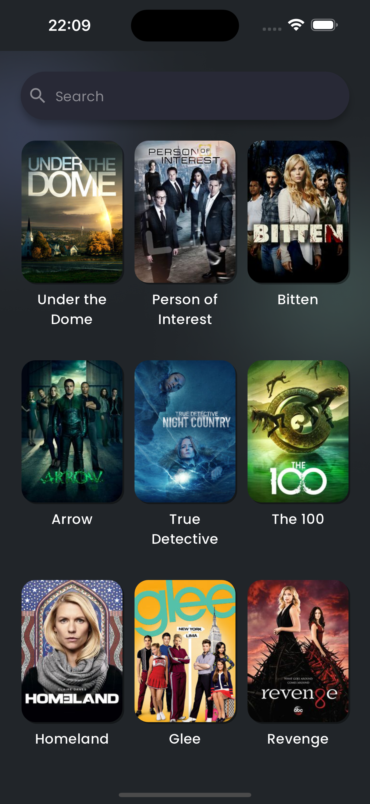
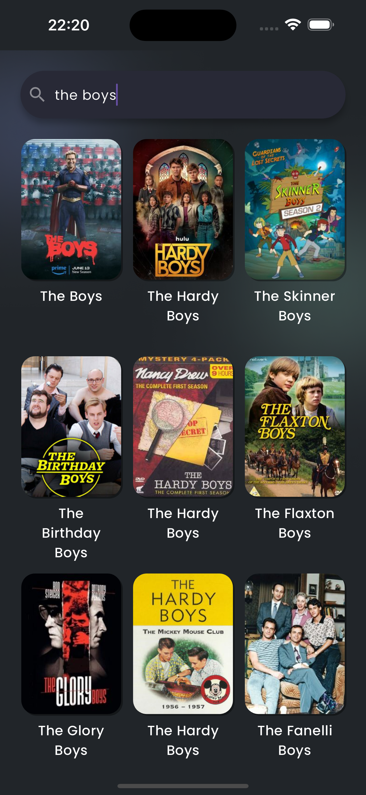
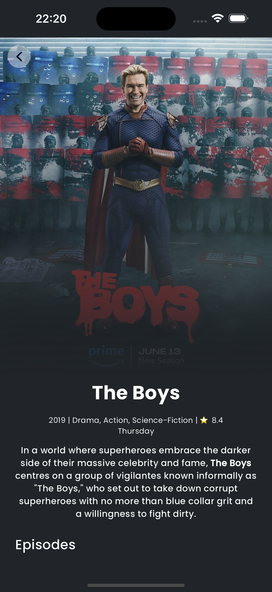
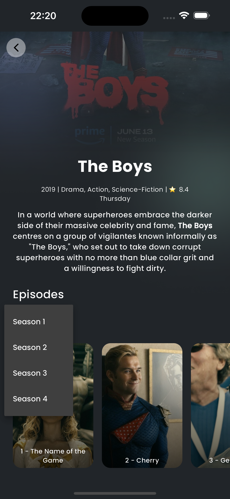
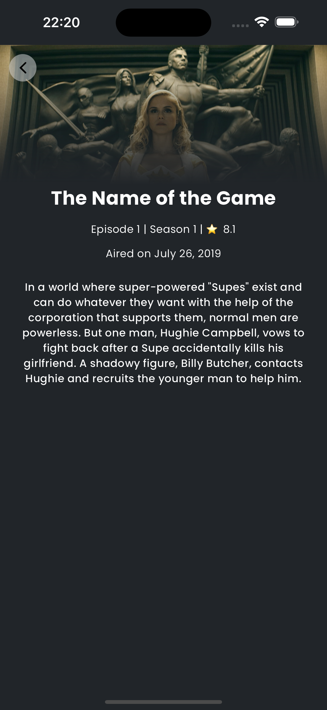

# Series Spot App

Series Spot Mobile app developed with Flutter and the [TVMaze API](https://www.tvmaze.com/api). It displays information regarding TV Shows and TV Episodes from TVMaze's huge database, utilizing the API's full potential with infinite scroll pagination to provide a seamless user experience.  

Built in accordance with Flutter's BLoC pattern and Clean Arch principles, below are the main packages used and their responsibility:

- State Management: `flutter_bloc`, more specifically Cubits
- Dependency Injection: `get_it`
- Internationalization: `intl` and `flutter_localizations`
- HTTP requests: `dio`
- Navigation: `go_router`
- Testing: `mocktail` and `bloc_test`

<p float="left">
  
   
  
  
  
</p>


## Run Instructions

To run the app:

1. Install [Flutter](https://docs.flutter.dev/get-started/install)

2. Run `flutter gen-l10n` to generate the `AppLocalizations` files. We currently support only English localization, but other languages are ready to be added within the current implementation.

3. Run the app with `flutter run`. It works on both Android and iOS!

### Testing from APK

It's possible to test the app directly without compiling. Simply open the pre-generated release APK available in this project's `test-apk` folder using any Android device; `test-apk` can be found in the repository's root folder. Please keep in mind that it may be necessary to [enable installing APKs from unknown sources](https://www.wikihow.com/Allow-Apps-from-Unknown-Sources-on-Android) in you phone settings.

### Flutter Version

```
Doctor summary (to see all details, run flutter doctor -v):
[✓] Flutter (Channel stable, 3.19.6, on macOS 14.4.1 23E224 darwin-arm64, locale en-GB)
[✓] Android toolchain - develop for Android devices (Android SDK version 32.0.0-rc1)
[✓] Xcode - develop for iOS and macOS (Xcode 15.3)
[✓] Chrome - develop for the web
[✓] Android Studio (version 2023.2)
[✓] VS Code (version 1.88.0)
[✓] Connected device (5 available)            
[✓] Network resources
```

### Test Coverage

We currently have full test coverage for the Domain layer's repositories, the localizations singleton and all cubits:
`00:03 +17: All tests passed!`
